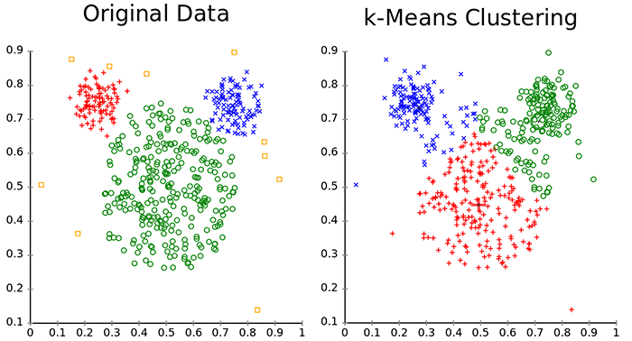
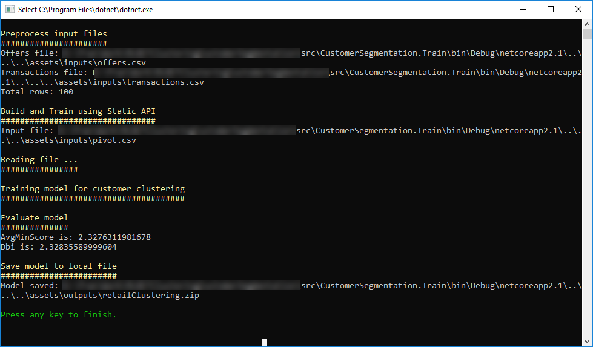
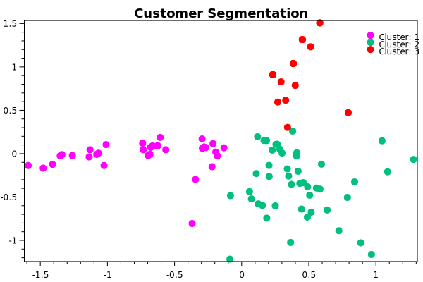

# 客户细分-聚类示例

| ML.NET 版本 | API 类型          | 状态                        | 应用程序类型    | 数据类型 | 场景            | 机器学习任务                   | 算法                  |
|----------------|-------------------|-------------------------------|-------------|-----------|---------------------|---------------------------|-----------------------------|
| v0.7           | 动态 API | 最新版 | 控制台应用程序 | .csv 文件 | 客户细分 | 聚类 | K-means++ |

## 问题

您想要**识别具有相似概况**的客户组，以便以后对他们准确定位（例如每个具有相似特征的已识别客户组进行不同的营销活动，等等）。

要解决的问题是，如何识别具有相似概况和兴趣的不同客户组，而无需任何预先存在的类别列表。你在分类列表中*不*分类客户，因为你的客户没有被*标记*所以你不能这样做。您只需要建立一组/几组客户，然后公司会将其用于其他业务目的。

## 数据集

在当前示例中，要处理的数据来自“The Wine Company”。这些数据基本上是该公司过去提供的报价/交易（营销活动的一部分）的历史记录，加上客户购买的历史记录。

训练数据集位于`assets/inputs` 文件夹中，并且拆分成两个文件。优惠文件包含有关特定优惠/优惠的过去营销活动的信息：

|Offer #|Campaign|Varietal|Minimum Qty (kg)|Discount (%)|Origin|Past Peak|
|-------|--------|--------|----------------|------------|------|---------|
|1|January|Malbec|72|56|France|FALSE|
|2|January|Pinot Noir|72|17|France|FALSE|
|3|February|Espumante|144|32|Oregon|TRUE|
|4|February|Champagne|72|48|France|TRUE|
|5|February|Cabernet Sauvignon|144|44|New Zealand|TRUE|

交易文件包含有关客户购买的信息（与上述优惠相关）：

|Customer Last Name|Offer #|
|------------------|-------|
|Smith|2|
|Smith|24|
|Johnson|17|
|Johnson|24|
|Johnson|26|
|Williams|18|

该数据集来自John Foreman的书籍[Data Smart]（http://www.john-foreman.com/data-smart-book.html）。

## ML 任务 - [聚类](https://en.wikipedia.org/wiki/Cluster_analysis)

解决此类问题的ML任务称为**聚类**。

通过应用聚类技术，您将能够识别类似的客户并将他们分组在集群中，而无需预先存在的类别和历史标记/分类数据。聚类是识别一组“相关或类似事物”的好方法，而无需任何预先存在的类别列表。这正是*聚类*和*分类*之间的主要区别。

在当前示例中用于这个任务的算法是*K-Means*。简而言之，该算法将数据集的样本分配给**k**簇：
* *K-Means* 不计算最佳簇数，因此这是一个算法参数
* *K-Means* 最小化每个点与群集的质心（中点）之间的距离
* 属于群集的所有点都具有相似的属性（但这些属性不一定直接映射到用于训练的特征，并且通常是进一步数据分析的目标）

使用群集绘制图表可帮助您直观地确定哪些群集的数据更适合您的数据，具体取决于您可以识别每个群集的隔离程度。 确定群集数量后，可以使用首选名称命名每个群集，并将每个客户群组/群集用于任何业务目的。

下图显示了集群数据分布的示例，然后，k-Means如何能够重新构建数据集群。



从上图中可以看出，有一个问题是：我们如何在二维空间中绘制由不同特征形成的样本？ 这是一个被称为“降维”的问题：每个样本属于由他的每个特征（提供，活动等）形成的维度空间，因此我们需要一个将前一个空间的观察“翻译”到另一个空间的功能（通常 在我们的例子中，功能少得多，只有两个：X和Y）。 在这种情况下，我们将使用一种称为PCA的通用技术，但是存在类似的技术，例如可以用于相同目的的SVD。


要解决这个问题，首先我们将建立一个ML模型。 然后，我们将在现有数据上训练模型，评估其有多好，最后我们将使用该模型将客户分类为集群。


### 1. 建立模型

#### 数据预处理

首先要做的是将数据加入到单个视图中。 因为我们需要比较用户进行的交易，我们将构建一个数据透视表，其中行是客户，列是活动，单元格值显示客户是否在该活动期间进行了相关事务。

数据透视表是执行PreProcess函数构建的，在本例中，PreProcess函数是通过将文件数据加载到内存中并使用Linq来join数据实现的。但您可以根据数据的大小使用任何其他方法，例如关系数据库或任何其他方法：

```csharp
// inner join datasets
var clusterData = (from of in offers
                   join tr in transactions on of.OfferId equals tr.OfferId
                   select new
                   {
                       of.OfferId,
                       of.Campaign,
                       of.Discount,
                       tr.LastName,
                       of.LastPeak,
                       of.Minimum,
                       of.Origin,
                       of.Varietal,
                       Count = 1,
                   }).ToArray();

// pivot table (naive way)
var pivotDataArray =
    (from c in clusterData
     group c by c.LastName into gcs
     let lookup = gcs.ToLookup(y => y.OfferId, y => y.Count)
     select new PivotData()
     {
         C1 = (float)lookup["1"].Sum(),
         C2 = (float)lookup["2"].Sum(),
         C3 = (float)lookup["3"].Sum(),
         // ...
      };
```

数据被保存到`pivot.csv`文件中，看起来像下面的表：

|C1|C2|C3|C4|C5|C6|C8|C9|C10|C11|C12|C13|C14|C15|C16|C17|C18|C19|C20|C21|C22|C23|C24|C25|C26|C27|C28|C29|C30|C31|C32|LastName|
|--|--|--|--|--|--|--|--|---|---|---|---|---|---|---|---|---|---|---|---|---|---|---|---|---|---|---|---|---|---|---|--------|
|1|0|0|1|0|0|0|0|1|0|1|0|0|1|0|0|0|0|0|0|0|0|0|0|0|1|0|0|0|0|0|0|Thomas|
|1|1|0|0|0|0|0|0|0|0|1|0|0|0|1|0|0|0|0|0|0|1|0|0|0|0|0|0|0|0|0|0|Jackson|
|1|1|0|0|0|0|0|0|0|0|0|0|0|0|0|0|0|0|0|0|0|0|0|0|0|0|0|0|0|0|0|0|Mitchell|

#### 模型管道

下面是用于建立模型的代码：
```csharp
//Create the MLContext to share across components for deterministic results
MLContext mlContext = new MLContext(seed: 1);  //Seed set to any number so you have a deterministic environment

// STEP 1: Common data loading configuration
TextLoader textLoader = mlContext.Data.TextReader(new TextLoader.Arguments()
                        {
                            Separator = ",",
                            HasHeader = true,
                            Column = new[]
                                        {
                                        new TextLoader.Column("Features", DataKind.R4, new[] {new TextLoader.Range(0, 31) }),
                                        new TextLoader.Column("LastName", DataKind.Text, 32)
                                        }
                        });

var pivotDataView = textLoader.Read(pivotCsv);

//STEP 2: Configure data transformations in pipeline
var dataProcessPipeline =  new PrincipalComponentAnalysisEstimator(mlContext, "Features", "PCAFeatures", rank: 2)
                                .Append(new OneHotEncodingEstimator(mlContext, new[] { new OneHotEncodingEstimator.ColumnInfo("LastName",
                                                                                                                                "LastNameKey",
                                                                                                                                OneHotEncodingTransformer.OutputKind.Ind) }));

//STEP 3: Create the training pipeline                
var trainer = mlContext.Clustering.Trainers.KMeans("Features", clustersCount: 3);
var trainingPipeline = dataProcessPipeline.Append(trainer);

```
在本例中， `TextLoader`不显式地定义每一列，而是定义由文件的前32列构成的`Features`属性；并将最后一列的值定义为`LastName`属性。

然后，您需要对数据应用一些转换： 

1) 使用评估器`PrincipalComponentAnalysisEstimator(mlContext, "Features", "PCAFeatures", rank: 2)`添加PCA列，传递参数`rank: 2`，这意味着我们将特征从32维减少到2维（*x*和*y*）

2) 使用`OneHotEncodingEstimator`转换LastName

3) 添加KMeansPlusPlusTrainer; 与该学习器一起使用的主要参数是`clustersCount`，它指定了簇的数量

### 2. 训练模型
在构建管道之后，我们通过使用所选算法拟合或使用训练数据来训练客户细分模型：
```csharp
ITransformer trainedModel = trainingPipeline.Fit(pivotDataView);
```
### 3. 评估模型
我们评估模型的准确性。 使用[ClusteringEvaluator](#)测量此准确度，并显示[Accuracy](https://en.wikipedia.org/wiki/Confusion_matrix)和[AUC](https://loneharoon.wordpress.com/2016/08/17/area-under-the-curve-auc-a-performance-metric/) 指标。

```csharp
var predictions = trainedModel.Transform(pivotDataView);
var metrics = mlContext.Clustering.Evaluate(predictions, score: "Score", features: "Features");
```
最后，我们使用动态API将模型保存到本地磁盘：
```csharp
 //STEP 6: Save/persist the trained model to a .ZIP file
using (var fs = new FileStream(modelZip, FileMode.Create, FileAccess.Write, FileShare.Write))
    mlContext.Model.Save(trainedModel, fs);
```
#### 运行模型训练

在Visual Studio中打开解决方案后，第一步是创建客户细分模型。 首先将项目`CustomerSegmentation.Train`设置为Visual Studio中的启动项目，然后单击F5。 将打开一个控制台应用程序，它将创建模型（并保存在[assets/output](./src/CustomerSegmentation.Train/assets/outputs/)文件夹中）。 控制台的输出类似于以下屏幕截图：



### 4. 使用模型

在`CustomerSegmentation.Predict`项目中使用在上一步中创建的模型用于项目“CustomerSegmentation.Predict”。 基本上，我们加载模型，然后加载数据文件，最后我们调用Transform来对数据执行模型。

在本例中，模型不是用来预测任何值（如回归任务）或对任何事物进行分类（如分类任务），而是基于客户的信息构建可能的集群/组。

下面的代码是如何使用模型创建这些集群：

```csharp
var reader = new TextLoader(_mlContext,
    new TextLoader.Arguments
    {
        Column = new[] {
            new TextLoader.Column("Features", DataKind.R4, new[] {new TextLoader.Range(0, 31) }),
            new TextLoader.Column("LastName", DataKind.Text, 32)
        },
        HasHeader = true,
        Separator = ","
    });

var data = reader.Read(new MultiFileSource(_pivotDataLocation));

//Apply data transformation to create predictions/clustering
var predictions = _trainedModel.Transform(data)
                .AsEnumerable<ClusteringPrediction>(_mlContext, false)
                .ToArray();
```

此外，方法`SaveCustomerSegmentationPlotChart()`使用[OxyPlot](http://www.oxyplot.org/)库保存绘制每个分配集群中的样本的散点图。

#### 运行模型并识别集群

要运行前面的代码，在Visual Studio中将 `CustomerSegmentation.Predict`项目设置为启动项目，然后点击F5。


在执行预测控制台应用程序之后，将生成绘图到assets/output文件夹中，显示集群分布（类似于下图）：



在该图表中，您可以识别3个群集。 在本例中，其中两个更好地分化（蓝色中的簇1和绿色中的簇2）。 但是，群集号3仅部分区分，部分客户与集群号码2重叠，这也可能发生在客户组中。